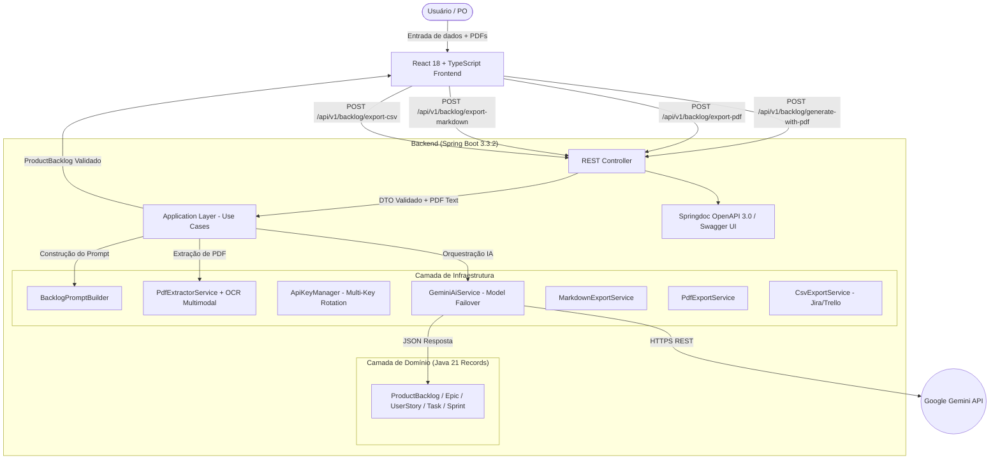

# BacklogForge — AI-Powered Product Backlog Generator

<p align="center">
  
  
  
  
  
  
  
  
  
</p>

---

## 📖 Visão Geral

**BacklogForge** é uma plataforma web completa para geração assistida por Inteligência Artificial de **Product Backlogs estruturados e prontos para execução** a partir da documentação de projetos de software (arquivos PDF vetoriais ou escaneados) e contexto complementar em texto.

O sistema foi concebido para empoderar **Product Owners, Scrum Masters, equipes de desenvolvimento e estudantes de engenharia de software** (como nas APIs da FATEC), eliminando o esforço braçal inicial na quebra de especificações técnicas complexas e entregando um planejamento determinístico com Épicos, Histórias de Usuário, Tarefas operacionais detalhadas, Critérios de Aceitação, Estimativas em Story Points (Fibonacci) e Distribuição em Sprints.

---

## ✨ Principais Funcionalidades

- 🧠 **Engenharia de Prompt & Schema Estruturado**: Decomposição consistente em Épicos -> Histórias -> Tarefas operacionais com descrições autoexplicativas, critérios de aceitação e estimativas em Fibonacci (1, 2, 3, 5, 8, 13).
- 📄 **Processamento Híbrido de PDFs**: Extração de texto vetorial via Apache PDFBox e acionamento automático de **OCR visual multimodal** com IA para PDFs escaneados ou baseados em imagens.
- ✏️ **Edição Inline Interativa (Live Backlog Editing)**: Altere títulos, descrições, pontuações, prioridades, critérios de aceitação, tarefas e metas de sprints diretamente na interface web antes de exportar.
- 📥 **Exportação Multiformato**:
  - 📑 **PDF Profissional (.pdf)**: Layout Slate/Indigo diagramado, paginação dinâmica com controle de estado e cabeçalhos RFC 6266.
  - 📝 **Markdown (.md)**: Documento estruturado para documentação técnica e repositórios Git.
  - 📊 **CSV Universal (.csv)**: Otimizado com UTF-8 BOM para importação direta no **Jira**, **Trello** e **Azure DevOps**.
  - 📋 **JSON Estruturado**: Cópia rápida para a área de transferência.
- 🔑 **Resiliência & Alta Disponibilidade Multi-Key**: Rotação automática de múltiplas chaves de API (`GEMINI_API_KEYS`), com cooldown e failover inteligente entre modelos candidatos (`gemini-2.5-flash`, `gemini-2.5-pro`, `gemini-3.6-flash`, `gemini-flash-latest`) diante de erros de cota (HTTP 429) ou alta demanda (HTTP 503).
- 🎯 **Geração Determinística de Sprints**: Normalização matemática garantindo que a quantidade de Sprints solicitada seja estritamente respeitada.
- 📑 **Documentação OpenAPI 3.0 & Swagger UI**: Documentação interativa em `/swagger-ui.html` e contrato OpenAPI em `/v3/api-docs`.
- ⚛️ **Interface Glassmorphic Moderna**: Desenvolvida em React 18 + TypeScript com Tailwind tokens em Vanilla CSS, feedback dinâmico de carregamento e drag-and-drop de arquivos.

---

## 🏛️ Arquitetura do Sistema



---

## 🛠️ Stack Tecnológica

### Backend (`backend/`)
- **Java 21** LTS
- **Spring Boot 3.3.2** (`web`, `validation`)
- **Springdoc OpenAPI 3.0 / Swagger UI** (`springdoc-openapi-starter-webmvc-ui` v2.6.0)
- **Google Gemini API** (`gemini-2.5-flash`, `gemini-2.5-pro`, `gemini-3.6-flash`, `gemini-flash-latest`)
- **Apache PDFBox 3.0.2** (Extração vetorial e renderização PNG para OCR)
- **Jackson Databind** com deserializadores resilientes
- **Dotenv Java 3.1.0** & **Maven Wrapper**

### Frontend (`frontend/`)
- **React 18** & **TypeScript**
- **Vite 8**
- **Lucide React** (Ícones modernos)
- **Vanilla CSS com Design Tokens** (Glassmorphism & Dark Mode nativo)

---

## 📡 Endpoints da API REST

| Método | Endpoint | Descrição | Formato Retornado |
| :--- | :--- | :--- | :--- |
| `POST` | `/api/v1/backlog/generate` | Gera o backlog a partir de JSON e texto | `application/json` |
| `POST` | `/api/v1/backlog/generate-with-pdf` | Gera o backlog com upload multipart de PDFs | `application/json` |
| `POST` | `/api/v1/backlog/export-markdown` | Exporta o backlog para download | `text/markdown; charset=UTF-8` |
| `POST` | `/api/v1/backlog/export-pdf` | Exporta o backlog em PDF diagramado | `application/pdf` |
| `POST` | `/api/v1/backlog/export-csv` | Exporta o backlog em CSV (Jira/Trello/Azure) | `text/csv; charset=UTF-8` |

> 📑 **Documentação Interativa da API**: [`http://localhost:8080/swagger-ui.html`](http://localhost:8080/swagger-ui.html)  
> 📡 **Especificação OpenAPI 3.0**: [`http://localhost:8080/v3/api-docs`](http://localhost:8080/v3/api-docs)

---

## ⚡ Início Rápido (Quick Start)

### 1. Clonar o Repositório e Configurar o Ambiente
```bash
git clone https://github.com/DanielDPereira/BacklogForge.git
cd BacklogForge

# Copiar arquivo de variáveis de ambiente
cp .env.example .env
```

Edite o arquivo `.env` inserindo sua chave gratuita do [Google AI Studio](https://aistudio.google.com/):
```env
# Chave individual ou múltiplas chaves separadas por vírgula para rotação de cota:
GEMINI_API_KEY=AIzaSySuaChaveDoGeminiAqui
# GEMINI_API_KEYS=chave1,chave2,chave3

GEMINI_MODEL=gemini-2.5-flash
SERVER_PORT=8080
SPRING_PROFILES_ACTIVE=dev
```

### 2. Iniciar o Backend (Spring Boot)
```bash
cd backend
.\mvnw.cmd spring-boot:run   # No Windows
./mvnw spring-boot:run       # No Linux/macOS
```
> API ativa em: `http://localhost:8080`

### 3. Iniciar o Frontend (React + Vite)
```bash
cd frontend
npm install
npm run dev
```
> Interface Web ativa em: `http://localhost:5173`

### 4. Executar Testes Automatizados
```bash
# Backend (25 testes cobrindo Use Cases, Controller, ApiKeyManager, Exports e JSON):
cd backend
.\mvnw.cmd test

# Frontend (Validação de tipos e build estático):
cd frontend
npm run build
```

---

## 📂 Estrutura do Repositório

```text
BacklogForge/
├── .env.example                  # Modelo de variáveis de ambiente
├── LICENSE                       # Licença MIT
├── README.md                     # Documento principal de apresentação
│
├── docs/                         # Central de Documentação Técnica
│   ├── index.md                  # Visão geral e índice de navegação
│   ├── architecture.md           # Arquitetura detalhada e decisões de design
│   ├── api-contracts.md          # Contratos de API REST e Schemas JSON
│   ├── setup-and-execution.md    # Guia completo de configuração e execução
│   └── backlog.md                # Product Backlog, User Stories (US-001 a US-020) e Roadmap
│
├── backend/                      # Aplicação Backend Spring Boot 3.3.2 (Java 21)
│   ├── src/main/java/com/backlogforge/
│   │   ├── application/          # Casos de uso e portas de serviço (Clean Architecture)
│   │   ├── domain/               # Entidades e records de domínio imutáveis
│   │   ├── infrastructure/       # Integração Gemini, ApiKeyManager, PDFBox, Exporters
│   │   └── web/                  # REST Controllers, DTOs, Swagger e Global Exception Handler
│   └── src/test/java/            # Suíte completa de testes unitários e de integração
│
└── frontend/                     # Aplicação Frontend React 18 + TypeScript + Vite
    ├── src/
    │   ├── components/           # Componentes visuais (BacklogViewer, ProjectForm, EpicCard, etc.)
    │   ├── services/             # Cliente HTTP REST para consumo da API
    │   ├── types/                # Definições de tipos TypeScript alinhados com o backend
    │   ├── index.css             # Design tokens e estilização Glassmorphic
    │   └── App.tsx               # Componente raiz da aplicação
    └── package.json
```

---

## 📚 Central de Documentação

Para aprofundar-se nos detalhes de engenharia do BacklogForge, consulte os documentos na pasta `docs/`:

- 🏛️ **[Arquitetura e Decisões de Design (`docs/architecture.md`)](./docs/architecture.md)** — Clean Architecture, resiliência de chaves, failover 429/503 e extração de PDFs.
- 📡 **[Contratos de API e Schemas (`docs/api-contracts.md`)](./docs/api-contracts.md)** — Especificações técnicas dos endpoints e payloads JSON/CSV/PDF/MD.
- 🚀 **[Guia de Configuração e Execução (`docs/setup-and-execution.md`)](./docs/setup-and-execution.md)** — Guia operacional para desenvolvedores e troubleshooting.
- 📋 **[Product Backlog e Roadmap (`docs/backlog.md`)](./docs/backlog.md)** — Registro completo das 20 User Stories e critérios de conclusão do MVP.

---

## 📄 Licença

Este projeto está sob a licença **MIT** — consulte o arquivo [LICENSE](./LICENSE) para mais detalhes.
