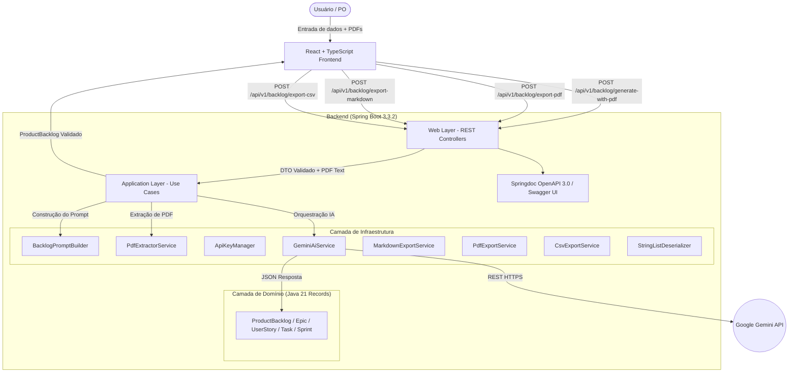

# Arquitetura e Decisões de Design — BacklogForge

Este documento descreve detalhadamente a arquitetura do **BacklogForge**, os padrões de projeto aplicados, a separação de responsabilidades e as decisões técnicas tomadas durante a construção da aplicação.

---

## 🏛️ Visão Geral da Arquitetura

O BacklogForge foi projetado como uma aplicação web moderna dividida em dois componentes principais (separados em uma estrutura monorepo limpa):

1. **Backend (`backend/`)**: Desenvolvido em **Java 21** com **Spring Boot 3.3.2**, responsável pela validação de parâmetros, processamento híbrido de documentos PDF (texto vetorial + OCR visual multimodal), construção determinística de prompts para IA, integração resiliente com o **Google Gemini API** (com rotação de chaves e fallback entre modelos candidatos) e exportação em **Markdown** e **PDF**.
2. **Frontend (`frontend/`)**: Desenvolvido em **React 18** com **TypeScript** e **Vite**, responsável por oferecer uma interface rica, responsiva e acessível com visualização em abas, formulários validados e exportação em múltiplos formatos.

---

## ☕ Decisões de Arquitetura no Backend

O backend segue os princípios de **Clean Architecture** e **Package by Feature/Layer**, separando a lógica central do sistema das dependências externas de framework.

### 1. Camada de Domínio (`com.backlogforge.domain`)
- **Imutabilidade com Java 21 Records**: As entidades de backlog (`ProductBacklog`, `Epic`, `UserStory`, `Task`, `Sprint`) foram implementadas como `record`s nativos do Java 21. Isso garante imutabilidade, concisão e facilidade de serialização com Jackson.
- **Isolamento de Regras**: O domínio não possui nenhuma dependência de frameworks externos (Spring, PDFBox ou bibliotecas HTTP).
- **Relacionamento por ID em Sprints**: Para evitar duplicação de dados, o modelo `Sprint` referencia as User Stories unicamente através da lista de seus IDs (`userStoryIds`), garantindo consistência no planejamento.

### 2. Camada de Aplicação (`com.backlogforge.application`)
- **Princípio da Inversão de Dependência (DIP)**: A aplicação define a interface `AiService`. A lógica de negócio (`GenerateBacklogUseCase`) depende exclusivamente dessa abstração, permitindo alternar ou mocking do provedor de IA.
- **Orquestração, Validação e Normalização Pós-Geração**: O caso de uso `GenerateBacklogUseCase` valida a resposta da IA e executa o algoritmo de normalização (`normalizeBacklog`) para garantir que o quantitativo de Sprints gerado corresponda exatamente ao número solicitado pelo usuário.

### 3. Camada de Infraestrutura (`com.backlogforge.infrastructure`)
- **Engenharia de Prompt (`BacklogPromptBuilder`)**: Monta um prompt estruturado contendo as regras estritas do negócio:
  1. Obrigatoriedade de estrutura hierárquica (Épicos -> User Stories -> Tasks).
  2. Número exato de Sprints.
  3. Calibração da granularidade das Tasks de acordo com o tamanho da equipe.
  4. **Proibição estrita de atribuição individual de tarefas a pessoas**.
  5. Preservação estrita da stack de tecnologias informada pelo usuário.
  6. Estimativa em Story Points pela sequência Fibonacci (1, 2, 3, 5, 8, 13).
  7. Resposta em formato JSON estrito sem formatação Markdown circundante.
  8. Obrigatoriedade de descrições autoexplicativas para todas as Tasks.
- **Extração Híbrida de PDFs e OCR (`PdfExtractorService`)**: Utiliza Apache PDFBox 3.0.2 para extrair texto vetorial. Caso o documento seja escaneado ou baseado em imagem (texto vetorial < 50 caracteres), o serviço renderiza as páginas em PNG (`PDFRenderer` a 150 DPI) e aciona a visão multimodal do Gemini para realizar OCR do conteúdo.
- **Gerenciamento Resiliente de Chaves e Modelos (`ApiKeyManager` & `GeminiAiService`)**: Suporta múltiplas chaves de API (`GEMINI_API_KEYS` ou `GEMINI_API_KEY` separadas por vírgula). Quando ocorre um limite de cota (HTTP 429) ou alta demanda momentânea do serviço (HTTP 503 High Demand), a chave entra em cooldown controlado e o sistema alterna imediatamente para a próxima chave e modelo candidato disponível (`gemini-2.5-flash`, `gemini-2.5-pro`, `gemini-3.6-flash`, `gemini-flash-latest`).
- **Serviço de Exportação em PDF (`PdfExportService`)**: Desenvolvido com Apache PDFBox, constrói um PDF elegante com tema Slate/Indigo, paginação dinâmica e gerenciamento de estado de fontes (`PageContext`) imune a exceções de quebra de página ou codificação ISO-8859-1/WinAnsi.
- **Serviço de Exportação em Markdown (`MarkdownExportService`)**: Transforma deterministicamente o objeto `ProductBacklog` em um documento `.md` perfeitamente estruturado.
- **Serviço de Exportação em CSV Universal (`CsvExportService`)**: Gera um arquivo CSV com cabeçalho padronizado e BOM UTF-8 (`\uFEFF`) para importação direta no **Jira**, **Trello** e **Azure DevOps**, mapeando tipos (`Epic`, `Story`, `Sub-task`) e relacionamentos de hierarquia (`Parent Id`).
- **Desserialização Resiliente (`StringListDeserializer`)**: Desserializador customizado Jackson que aceita listas de strings, listas de objetos ou strings únicas delimitadas por vírgula para o campo `suggestedTechnologies`.

### 4. Camada Web (`com.backlogforge.web`)
- **Contratos DTO com Bean Validation**: A classe `GenerateBacklogRequest` utiliza anotações Bean Validation (`@NotBlank`, `@Min`, `@Max`, `@Size`) para rejeitar entradas inválidas na borda da aplicação.
- **Documentação OpenAPI 3.0 / Swagger UI**: Integração com `springdoc-openapi-starter-webmvc-ui` expondo a interface interativa em `/swagger-ui.html` e a especificação JSON em `/v3/api-docs`.
- **Tratamento Global de Exceções (`GlobalExceptionHandler`)**: Intercepta exceções da aplicação (`InvalidBacklogException`, `InvalidDocumentException`, `AiProviderException`) e retorna respostas JSON em formato padronizado com códigos HTTP apropriados (400, 422, 502, 500).
- **Cabeçalhos HTTP Conformes com RFC 6266**: Os endpoints de exportação utilizam `ContentDisposition.attachment().filename(..., StandardCharsets.UTF_8).build()` para prevenir erros de codificação de cabeçalho no Tomcat.

---

## ⚛️ Decisões de Arquitetura no Frontend

O frontend foi desenvolvido com foco em performance, acessibilidade e riqueza estética (*Rich Aesthetics*).

### 1. Tecnologia e Ferramentas
- **Vite + React 18 + TypeScript**: Proporcionam tempo de build ultra-rápido, tipagem estática rigorosa e desenvolvimento ágil.
- **Vanilla CSS com Design Tokens**: Utiliza variáveis CSS (`index.css`) para gerenciar a paleta de cores Dark Mode (Fundo `#0b0f19`, superfícies `#151c2c`, marcas `#6366f1` e `#8b5cf6`), fontes do Google Fonts (*Outfit* e *Inter*) e efeitos de glassmorphism.
- **Lucide React**: Biblioteca de ícones vetoriais modernos.

### 2. Organização dos Componentes e Estado
- `Header.tsx`: Identidade visual da aplicação e indicação de status.
- `ProjectForm.tsx`: Formulário interativo com validações, controles numéricos, seletor de tecnologias com tags e suporte a texto livre.
- `PdfUploader.tsx`: Drag-and-drop de PDFs com suporte a múltiplos arquivos, indicação de tamanho em MB e opção de remoção individual.
- `BacklogViewer.tsx`: Painel com navegação em abas (*Visão por Épicos* vs. *Quadro de Sprints*), botões de download em **PDF (.pdf)**, **Markdown (.md)**, **CSV Jira/Trello (.csv)**, cópia de JSON, modo de edição interativa inline e reinício de projeto.
- `EpicCard.tsx`: Cards sanfonados (accordion) de Épicos e User Stories com pílulas coloridas para cada prioridade (`CRITICAL`, `HIGH`, `MEDIUM`, `LOW`), com suporte a formulários inline de edição de títulos, descrições, prioridades, critérios e tarefas.
- `SprintBoard.tsx`: Visualização em cards de Sprints exibindo o objetivo e o total de Story Points alocados, com suporte a edição inline de nomes e metas de sprint.
- `LoadingOverlay.tsx`: Tela de carregamento com dicas rotativas sobre a IA durante o processamento.

---

## 🔒 Segurança e Chaves de API

1. **Sem Credenciais no Código**: O código-fonte não contém chaves de API codificadas.
2. **Carregamento Seguro por Ambiente**: As chaves são lidas do arquivo `.env` (ignorado pelo `.gitignore`) utilizando `Dotenv`.
3. **Múltiplas Chaves para Rotação**: Suporta `GEMINI_API_KEYS=key1,key2,key3` para alta disponibilidade em ambientes de cota gratuita.
4. **Template Versionado**: O repositório fornece o modelo `.env.example` devidamente documentado.
