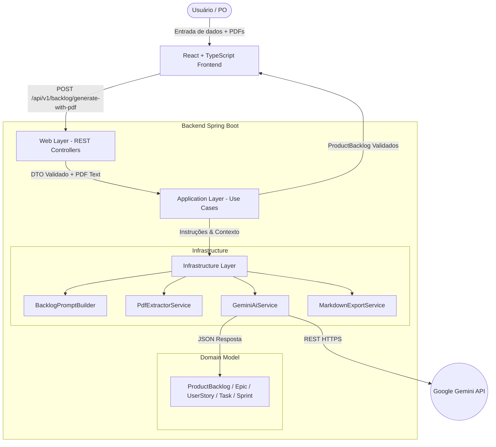

# Arquitetura e Decisões de Design — BacklogForge

Este documento descreve detalhadamente a arquitetura do **BacklogForge**, os padrões de projeto aplicados, a separação de responsabilidades e as decisões técnicas tomadas durante a construção da aplicação.

---

## 🏛️ Visão Geral da Arquitetura

O BacklogForge foi projetado como uma aplicação web moderna dividida em dois componentes principais (separados em uma estrutura monorepo limpa):

1. **Backend (`backend/`)**: Desenvolvido em **Java 21** com **Spring Boot 3.3.2**, responsável pela validação de parâmetros, processamento de documentos PDF, construção determinística de prompts para IA, integração com o modelo **Google Gemini 1.5 Flash** e geração do Markdown final.
2. **Frontend (`frontend/`)**: Desenvolvido em **React** com **TypeScript** e **Vite**, responsável por oferecer uma interface rica, responsiva e acessível para entrada de dados e visualização/exportação do backlog.

---

## ☕ Decisões de Arquitetura no Backend

O backend segue os princípios de **Clean Architecture** e **Package by Feature/Layer**, separando a lógica central do sistema das dependências externas de framework.

### 1. Camada de Domínio (`com.backlogforge.domain`)
- **Imutabilidade com Java 21 Records**: As entidades de backlog (`ProductBacklog`, `Epic`, `UserStory`, `Task`, `Sprint`) foram implementadas como `record`s nativos do Java 21. Isso garante imutabilidade, concisão e facilidade de serialização com Jackson.
- **Isolamento de Regras**: O domínio não possui nenhuma dependência de frameworks externos (Spring, PDFBox ou bibliotecas HTTP).
- **Relacionamento por ID em Sprints**: Para evitar duplicação de dados, o modelo `Sprint` referencia as User Stories unicamente através da lista de seus IDs (`userStoryIds`), garantindo consistência no planejamento.

### 2. Camada de Aplicação (`com.backlogforge.application`)
- **Princípio da Inversão de Dependência (DIP)**: A aplicação define a interface `AiService`. A lógica de negócio (`GenerateBacklogUseCase`) depende exclusivamente dessa abstração, sem saber se a chamada é feita ao Gemini, OpenAI ou a um mock local de testes.
- **Orquestração e Validação Pós-Geração**: O caso de uso `GenerateBacklogUseCase` verifica se o backlog produzido pela IA atende a todos os parâmetros determinísticos antes de retorná-lo ao usuário (por exemplo, validando se a quantidade de Sprints corresponde exatamente ao número solicitado).

### 3. Camada de Infraestrutura (`com.backlogforge.infrastructure`)
- **Engenharia de Prompt (`BacklogPromptBuilder`)**: Monta um prompt estruturado contendo as regras estritas do negócio:
  1. Obrigatoriedade de estrutura hierárquica (Épicos -> User Stories -> Tasks).
  2. Número exato de Sprints.
  3. Calibração da granularidade das Tasks de acordo com o tamanho da equipe.
  4. **Proibição estrita de atribuição individual de tarefas a nomes de integrantes**.
  5. Estimativa em Story Points pela sequência Fibonacci (1, 2, 3, 5, 8, 13).
  6. Resposta em formato JSON estrito sem formatação Markdown circundante.
- **Integração com Gemini API (`GeminiAiService`)**: Utiliza chamadas HTTP otimizadas com tratamento de erros e sanitização de blocos de código JSON.
- **Extração de Texto de PDFs (`PdfExtractorService`)**: Utiliza Apache PDFBox 3.x para ler e concatenar múltiplos arquivos PDF fornecidos no upload multipart.
- **Gerador de Markdown (`MarkdownExportService`)**: Transforma deterministicamente o objeto `ProductBacklog` em um documento `.md` com formatação limpa e organizada.

### 4. Camada Web (`com.backlogforge.web`)
- **Contratos DTO com Bean Validation**: A classe `GenerateBacklogRequest` utiliza anotações Bean Validation (`@NotBlank`, `@Min`, `@Max`, `@Size`) para rejeitar entradas inválidas na borda da aplicação.
- **Tratamento Global de Exceções (`GlobalExceptionHandler`)**: Intercepta exceções da aplicação (`InvalidBacklogException`, `InvalidDocumentException`, `AiProviderException`) e retorna respostas JSON em formato padronizado com códigos HTTP apropriados (400, 422, 502, 500).

---

## ⚛️ Decisões de Arquitetura no Frontend

O frontend foi desenvolvido com foco em performance, acessibilidade e riqueza estética (*Rich Aesthetics*).

### 1. Tecnologia e Ferramentas
- **Vite + React 18 + TypeScript**: Proporcionam tempo de build ultra-rápido, tipagem estática rigorosa e desenvolvimento ágil.
- **Vanilla CSS com Design Tokens**: Utiliza variáveis CSS (`index.css`) para gerenciar a paleta de cores Dark Mode (Fundo `#0b0f19`, superfícies `#151c2c`, marcas `#6366f1` e `#8b5cf6`), fontes do Google Fonts (*Outfit* e *Inter*) e efeitos de glassmorphism.
- **Lucide React**: Biblioteca de ícones vetoriais modernos.

### 2. Organização dos Componentes
- `Header.tsx`: Identidade visual da aplicação e status de tecnologias.
- `ProjectForm.tsx`: Formulário interativo com validações, controles numéricos, seletor de tecnologias com tags e suporte a texto livre.
- `PdfUploader.tsx`: Drag-and-drop de PDFs com suporte a múltiplos arquivos, indicação de tamanho em MB e opção de remoção individual.
- `BacklogViewer.tsx`: Painel com navegação em abas (*Visão por Épicos* vs. *Quadro de Sprints*), botão de download do `.md` e cópia do JSON.
- `EpicCard.tsx`: Cards sanfonados (accordion) de Épicos e User Stories com pílulas coloridas para cada prioridade (`CRITICAL`, `HIGH`, `MEDIUM`, `LOW`).
- `SprintBoard.tsx`: Visualização em cards de Sprints exibindo o objetivo e o total de Story Points alocados.
- `LoadingOverlay.tsx`: Tela de carregamento com dicas rotativas sobre a IA durante o processamento.

---

## 🔒 Segurança e Chaves de API

1. **Sem Chaves no Código**: A aplicação **nunca** armazena chaves de API nos arquivos do repositório.
2. **Leitura via Ambiente**: A chave da API do Gemini é lida através da variável de ambiente `GEMINI_API_KEY` (configurada via arquivo local `.env` ignorado no `.git`).
3. **Template Versionado**: O repositório disponibiliza um arquivo `.env.example` servindo como modelo explicativo para os desenvolvedores.
